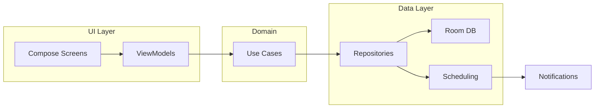

# MelhoreApp – Architecture

## Overview

The app uses a **layered architecture** with **MVVM** at the UI layer:

- **UI layer:** Compose screens and ViewModels; displays data and handles user input.
- **Domain layer:** Use cases (optional; can live inside feature modules for now).
- **Data layer:** Repositories (or direct DAO usage), Room database, and scheduling (WorkManager).

The UI layer does not talk to the database or scheduling directly; it goes through ViewModels and use cases/repositories.

## Data flow

## Module dependencies

- **app** → all feature modules, all core modules.
- **feature:reminders** → core:common, core:database, core:scheduling.
- **feature:categories** / **feature:lists** → core:common, core:database.
- **feature:settings** → core:common, core:notifications.
- **core:scheduling** → core:common, core:notifications, core:database.
- **core:database** → core:common; provides Room DB and DAOs via Hilt.
- **core:notifications** → core:common.
- **core:common** → no internal app modules.

## Key decisions

- **WorkManager vs AlarmManager:** Prefer **WorkManager** for scheduling reminder notifications. Use **AlarmManager** (e.g. `setExactAndAllowWhileIdle`) only if exact-time alarms are required; document battery and policy impact in this file if added.
- **Database:** Room in **core:database**; single `MelhoreDatabase` with Reminder, Category, List entities; provided via Hilt `DatabaseModule` in the same module.
- **Notifications:** Channels created in `Application.onCreate` via `NotificationHelper.createChannels()`; reminders and snooze use the same or separate channels (see `NotificationHelper`).
- **Scheduling:** One-time and recurring reminders are scheduled from the data/feature layer; `ReminderWorker` (HiltWorker) runs at trigger time and shows the notification using **core:notifications**.

## Package structure (per module)

- **app:** `com.melhoreapp` – Application, MainActivity, `ui/theme/`, `ui/navigation/`.
- **core:database:** `com.melhoreapp.core.database` – `entity/`, `dao/`, `MelhoreDatabase`, `DatabaseModule`.
- **core:notifications:** `com.melhoreapp.core.notifications` – `NotificationHelper`, resources.
- **core:scheduling:** `com.melhoreapp.core.scheduling` – `ReminderWorker`, scheduling API (to be expanded).
- **feature:** `com.melhoreapp.feature.<name>` – `ui/<screen>/`, `data/`, `domain/` (optional).

Update this document when adding new modules or changing data/scheduling flow.
