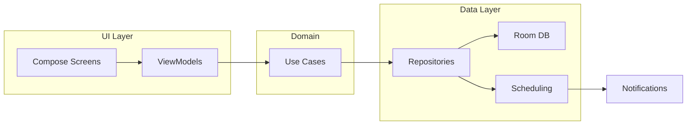
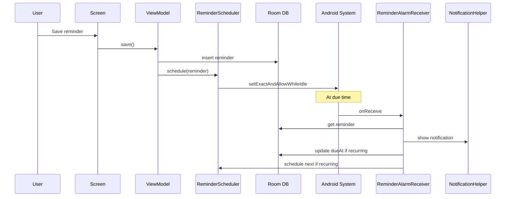
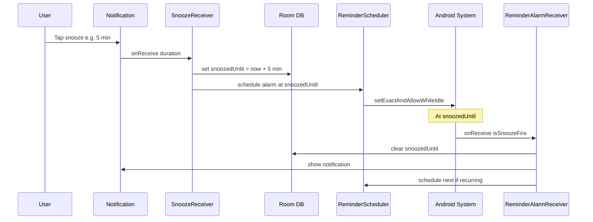

# MelhoreApp – Architecture

## Overview

The app uses a **layered architecture** with **MVVM** at the UI layer:

- **UI layer:** Compose screens and ViewModels; displays data and handles user input.
- **Domain layer:** Use cases (optional; can live inside feature modules for now).
- **Data layer:** Repositories (or direct DAO usage), Room database, and scheduling (AlarmManager for one-time reminders).

The UI layer does not talk to the database or scheduling directly; it goes through ViewModels and use cases/repositories.

## Data flow

### Create reminder and notify (simplified)

### Snooze flow (simplified)

## Module dependencies

- **app** → all feature modules, all core modules.
- **feature:reminders** → core:common, core:database, core:scheduling.
- **feature:categories** (Tags in UI) → core:common, core:database.
- **feature:settings** → core:common, core:notifications.
- **core:scheduling** → core:common, core:notifications, core:database.
- **core:database** → core:common; provides Room DB and DAOs via Hilt.
- **core:notifications** → core:common.
- **core:common** → no internal app modules.

## Key decisions

- **WorkManager vs AlarmManager:** One-time and recurring reminders use **AlarmManager** (`setExactAndAllowWhileIdle`) so notifications fire at due time even when the app is killed. Requires `SCHEDULE_EXACT_ALARM` (API 31+); on Android 14+ this permission may need to be granted in settings. Recurring reminders reschedule on each fire: when an alarm fires, `ReminderAlarmReceiver` shows the notification, then if the reminder is DAILY/WEEKLY it computes the next occurrence, updates `dueAt` in the DB, and schedules the next alarm. Exact alarms have minor battery impact; Google Play allows them for calendar/alarm/reminder use cases.
- **Database:** Room in **core:database**; single `MelhoreDatabase` with Reminder, Category, List, and **ChecklistItem** entities; provided via Hilt `DatabaseModule` in the same module. Reminders can have **checklist items** (one-to-many); `ChecklistItemDao` provides getItemsByReminderId, insert/update/delete, and getAllItems for list progress.
- **Notifications:** Channels created in `Application.onCreate` via `NotificationHelper.createChannels()`; reminders use channel `reminders`; snoozed reminders can use the same or `snoozed` channel. Reminder notifications include **snooze actions** (5 min, 15 min, 1 hour, 1 day)—the user chooses one of these four. When the intent has no duration extra, `SnoozeReceiver` uses the **default snooze duration** from `AppPreferences` (core:common), which the user can set in Settings. `SnoozeReceiver` (core:scheduling) receives the chosen duration via intent extra.
- **Scheduling:** Reminders are scheduled via `ReminderScheduler` in **core:scheduling** using AlarmManager. At trigger time the system delivers to `ReminderAlarmReceiver`, which shows the notification (with snooze actions), then for recurring reminders advances `dueAt` and reschedules the next alarm. **Snooze flow:** User taps a snooze option (5 min, 15 min, 1 hour, 1 day) on the notification → `SnoozeReceiver` sets `snoozedUntil = now + chosen duration`, updates DB, schedules one alarm at `snoozedUntil` with `isSnoozeFire=true`. When that alarm fires, the receiver clears `snoozedUntil` and, if recurring, schedules the next occurrence. **Boot reschedule:** `BootReceiver` (app) runs on BOOT_COMPLETED and calls `rescheduleAllUpcomingReminders()`: loads all active reminders, for each computes trigger time (snoozedUntil if set and in future, else dueAt; for recurring with past dueAt advances to next occurrence and updates DB), then schedules. `SchedulingContext` (interface) is implemented by the Application so receivers can access database and scheduler without Hilt.
- **Notification permission:** On API 33+ (Android 13), `POST_NOTIFICATIONS` is requested at runtime from the app layer (MainActivity) when the main UI is shown.
- **App preferences:** App-level settings (e.g. default snooze duration) are stored in **core:common** via `AppPreferences` (SharedPreferences, name `melhore_app_prefs`). **feature:settings** writes preferences from the Settings screen; **core:scheduling** (e.g. `SnoozeReceiver`) reads them when the process runs (receivers use `AppPreferences(context.applicationContext)`; no Hilt in receivers). **Reminder list filter and sort** (Sprint 6): last-used filter (category IDs, priority ordinals, date range from/to) and sort order are also stored in `AppPreferences` and restored in **ReminderListViewModel** on load; the ViewModel persists filter and sort whenever the user changes them.
- **Reminder list filter and sort:** The reminder list supports **filter** by multiple tags (OR semantics; `ReminderDao.getRemindersByCategoryIds` when non-empty), by priority (in-memory), and by date range (in-memory). **Sort** options: due date (asc), priority then due date, title (asc), creation date (asc or desc). Sorting and in-memory filters are applied in **ReminderListViewModel** over the DAO output; only multi-tag uses a dedicated DAO method. Priority is always visible on each reminder card (badge).

## Dependency injection and receivers

- **Hilt:** The app and core modules use Hilt for dependency injection (e.g. `DatabaseModule`, `SchedulingModule`). ViewModels and screens get dependencies via constructor injection. Broadcast receivers (`ReminderAlarmReceiver`, `SnoozeReceiver`, `BootReceiver`) do not use Hilt; they obtain database and scheduler via `SchedulingContext`, which the Application implements and provides when the process runs.

## Error handling

- **Scheduling failures:** If exact-alarm permission is missing (e.g. on Android 14+ when not granted in settings), scheduling may throw `ExactAlarmPermissionRequiredException`. The app layer (e.g. AddReminderViewModel or MainActivity) should catch this and surface a message to the user (e.g. "Allow exact alarms in settings to get reminders on time") or open the relevant settings screen. Other scheduling failures (e.g. invalid time) are handled in the layer that calls `ReminderScheduler` and can be shown as a snackbar or error state in the UI.

## Package structure (per module)

- **app:** `com.melhoreapp` – Application, MainActivity, `ui/theme/`, `ui/navigation/`.
- **core:common:** `com.melhoreapp.core.common` – `Result.kt`, `preferences/AppPreferences.kt` (SharedPreferences for default snooze etc.).
- **core:database:** `com.melhoreapp.core.database` – `entity/`, `dao/`, `MelhoreDatabase`, `DatabaseModule`.
- **core:notifications:** `com.melhoreapp.core.notifications` – `NotificationHelper`, resources.
- **core:scheduling:** `com.melhoreapp.core.scheduling` – `ReminderScheduler`, `ReminderAlarmReceiver`, `SnoozeReceiver`, `RecurrenceHelper` (next occurrence), `SchedulingContext` (interface), `ReminderWorker`, `SchedulingModule` (AlarmManager + scheduler provided via Hilt).
- **feature:** `com.melhoreapp.feature.<name>` – `ui/<screen>/`, `data/`, `domain/` (optional). **feature:categories** (shown as Tags in the app) uses `ui/list/` (list screen + ViewModel) and `ui/addedit/` (add/edit screen + ViewModel). **feature:reminders** reminder list screen includes **multi-tag filter**, **priority filter**, **date range filter** (e.g. Próximos 7 dias, Este mês), and **sort** by date, priority, title, or creation date (ViewModel uses ReminderDao, including `getRemindersByCategoryIds`, and ChecklistItemDao; filter/sort state and persistence via AppPreferences); priority badge and checklist progress "checked/total" on each item; add/edit reminder screen supports **checklist items** (add/remove/toggle) and **edit mode** (route `reminders/edit/{reminderId}`; load and save reminder + checklist). **feature:settings** – `ui/SettingsScreen.kt`, `SettingsViewModel`; reads/writes `AppPreferences` for default snooze duration; Settings is a bottom-nav tab (Reminders, Tags, Settings).

Update this document when adding new modules or changing data/scheduling flow.
