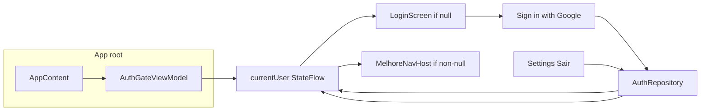

# MelhoreApp – Architecture

## Overview

The app uses a **layered architecture** with **MVVM** at the UI layer:

- **UI layer:** Compose screens and ViewModels; displays data and handles user input.
- **Domain layer:** Use cases (optional; can live inside feature modules for now).
- **Data layer:** Repositories (or direct DAO usage), Room database, and scheduling (AlarmManager for one-time reminders).

The UI layer does not talk to the database or scheduling directly; it goes through ViewModels and use cases/repositories.

## Data flow

### Create reminder and notify (simplified)

### Snooze flow (simplified)

### "Fazendo" snooze flow (Sprint 14)

## Auth flow (Sprint 16)

### Local-only mode (Sprint 19.5)

Users can tap **"Continuar sem entrar"** on the login screen to use the app without signing in. `AuthRepository.useLocalOnly()` sets a preference and emits synthetic `CurrentUser("local", null)` so the auth gate shows the main app. `AuthGateViewModel` skips migration and sync when `userId == "local"` (only sets `lastUserId` for boot reschedule). All sync/cloud calls (uploadAll, deleteFromCloud, etc.) are guarded so they are not invoked when `userId == "local"`. The Reminder list shows a static row **"Apenas neste aparelho"** instead of sync status when in local-only mode. Sign out for a local user clears the local-only preference and returns to the login screen; local data (userId = 'local') remains in the database so the user can tap "Continuar sem entrar" again and see the same data.

### Cloud sync (Sprint 18)

On app start (user signed in): `AuthGateViewModel` runs `syncRepository.syncAll(userId)` (download from Firestore, merge into Room with cloud wins, then upload local state), then `enableAutoSync(userId)` to register Firestore snapshot listeners. On local create/update: ViewModels call `syncRepository.uploadAll(userId)`. On local delete: ViewModels call `syncRepository.deleteReminderFromCloud(userId, id)` (or deleteCategoryFromCloud / deleteChecklistItemFromCloud). Conflict resolution: for reminders use `updatedAt` (cloud wins when newer); for categories and checklist items overwrite with cloud.

### Data migration (Sprint 19)

When the user signs in, `AuthGateViewModel` checks `MigrationHelper.needsMigration(userId)`: true if there is local data (reminders or categories with `userId = 'local'`) and migration has not been completed for this user (flag in `AppPreferences`). If migration is needed, a dialog is shown with three options: **Upload local** (assign local data to user, upload to cloud), **Merge with cloud** (assign local to user, then run `syncAll`), **Start fresh** (delete local data, then run `syncAll` to pull cloud only). After the chosen action, migration is marked complete and `enableAutoSync(userId)` runs. **Sync status:** `SyncRepository` exposes `syncStatus: StateFlow<SyncStatus>` (Idle, Syncing, Synced, Error); the Reminder list screen shows a status row (Sincronizando… / Sincronizado / Erro de sincronização with "Tentar novamente" button). Retry calls `syncRepository.retrySync(userId)` (same as `syncAll`).

## Module dependencies

- **app** → all feature modules, all core modules (including core:auth, feature:auth).
- **feature:reminders** → core:common, core:database, core:scheduling, core:auth, core:sync.
- **feature:categories** (Tags in UI) → core:common, core:database, core:auth, core:sync.
- **feature:auth** → core:common, core:auth.
- **feature:integrations** → core:common.
- **feature:settings** → core:common, core:notifications, core:auth, core:sync.
- **core:scheduling** → core:common, core:notifications, core:database.
- **core:sync** → core:common, core:database, Firebase Firestore.
- **core:auth** → core:common, Firebase Auth.
- **core:database** → core:common; provides Room DB and DAOs via Hilt.
- **core:notifications** → core:common.
- **core:common** → no internal app modules.

## Key decisions

- **WorkManager vs AlarmManager:** One-time and recurring reminders use **AlarmManager** (`setExactAndAllowWhileIdle`) so notifications fire at due time even when the app is killed. Requires `SCHEDULE_EXACT_ALARM` (API 31+); on Android 14+ this permission may need to be granted in settings. Recurring reminders reschedule on each fire: when an alarm fires, `ReminderAlarmReceiver` shows the notification, then if the reminder is DAILY/WEEKLY it computes the next occurrence, updates `dueAt` in the DB, and schedules the next alarm. Exact alarms have minor battery impact; Google Play allows them for calendar/alarm/reminder use cases.
- **Database:** Room in **core:database**; single `MelhoreDatabase` with Reminder, Category, List, and **ChecklistItem** entities; provided via Hilt `DatabaseModule` in the same module. Reminders can have **checklist items** (one-to-many); `ChecklistItemDao` provides getItemsByReminderId, insert/update/delete, and getAllItems for list progress. **ReminderStatus (Sprint 13):** Reminders have a `status` field (`ReminderStatus` enum: ACTIVE, COMPLETED, CANCELLED) instead of just `isActive` boolean; database migration 2→3 adds `status` column (existing records default to ACTIVE). **Routine Type and Custom Recurrence (Sprint 12):** Reminders have an `isRoutine: Boolean` field to distinguish Routine reminders from regular Melhores; `customRecurrenceDays: String?` field stores custom recurrence days as comma-separated string (e.g., "MONDAY,WEDNESDAY,FRIDAY"); `RecurrenceType` enum includes `CUSTOM` for custom recurrence patterns; database migration 3→4 adds `isRoutine` and `customRecurrenceDays` columns. **Parent-Child Relationship (Sprint 12.1):** Reminders have `parentReminderId: Long?` for parent-child relationships (Rotina → tasks), `startTime: Long?` for task start times, `checkupFrequencyHours: Int?` for checkup frequencies, and `isTask: Boolean` to distinguish task reminders; database migration 4→5 adds these columns with foreign key cascade delete. **Database Index Optimization (Sprint 12.1):** Migration 5→6 adds indexes for query performance: single-column indexes on `status` and `startTime`; composite indexes on `(status, dueAt)` for active reminder queries, `(isTask, status)` for task filtering, and `(parentReminderId, startTime, dueAt)` for parent-child queries with ordering. Indexes match actual query patterns to optimize WHERE clauses and ORDER BY operations. Queries in `ReminderDao` are optimized to leverage these indexes: `getUpcomingActiveReminders()` uses composite index `(status, dueAt)`, `getActiveReminders()` uses `status` index, `getTasksByParentReminderId()` uses composite index `(parentReminderId, startTime, dueAt)`, and `getAllRemindersExcludingTasks()` uses `isTask` index. SQLite's query planner automatically selects the optimal index for each query.
- **Date and timezone handling:** Reminder `dueAt` is stored as epoch millis (instant in time). Material3 DatePicker returns `selectedDateMillis` as UTC midnight for the selected calendar day. To keep list and add/edit dates aligned, we pass UTC midnight for the intended local date when initializing the picker and, on confirm, derive the calendar day using `ZoneOffset.UTC` from `selectedDateMillis`, then merge with the chosen time in `ZoneId.systemDefault()` and convert to epoch. The list (and all display) formats epoch millis using `ZoneId.systemDefault()` so the user sees the correct local date and time. For recurring reminders, the list shows the "next notification" date from `RecurrenceHelper.nextOccurrenceMillis()`: that function returns the first occurrence at or after now (it only advances by one period when the current occurrence is already in the past), so today's occurrence is shown when it has not yet passed.
- **Notifications:** Channels created in `Application.onCreate` via `NotificationHelper.createChannels()`; reminders use channel `reminders`; snoozed reminders can use the same or `snoozed` channel. Reminder notifications include **snooze actions**—the user chooses from available options. Android limits notifications to 3 visible actions. When the intent has no duration extra, `SnoozeReceiver` uses the **default snooze duration** from `AppPreferences` (core:common), which the user can set in Settings. `SnoozeReceiver` (core:scheduling) receives the chosen duration via intent extra. **Snooze options settings (Sprint 15):** User can enable/disable snooze options in Settings. Available options: "5 minutos", "15 minutos", "30 minutos", "1 hora", "2 horas", "1 dia", "Personalizar". Maximum 3 options can be selected at once (validation in SettingsViewModel); `ReminderAlarmReceiver` reads enabled options from `AppPreferences` and only shows enabled actions (up to 3). **"Fazendo" special flow (Sprint 14):** "Fazendo" is not shown in regular notifications due to Android's 3-action limit, but the follow-up flow remains available. When "Fazendo" follow-up fires (`isFazendoFollowup=true`), `ReminderAlarmReceiver` shows a completion check notification: "Você estava fazendo {title}, você completou?" with actions "Sim" (mark complete), "+15 min", "+1 hora", "Personalizar". `CompletionCheckReceiver` handles these actions: "Sim" marks reminder as COMPLETED and cancels alarms; other actions snooze with respective durations.
- **Scheduling:** Reminders are scheduled via `ReminderScheduler` in **core:scheduling** using AlarmManager. At trigger time the system delivers to `ReminderAlarmReceiver`, which shows the notification (with snooze actions), then for recurring reminders advances `dueAt` and reschedules the next alarm. **Snooze flow (Sprint 14):** User taps a snooze option ("Fazendo", "15 min", "1 hora", "Personalizar") on the notification → `SnoozeReceiver` handles the action. For "Fazendo", it schedules a special follow-up notification in 1 hour with `isFazendoFollowup=true`. For other options, it sets `snoozedUntil = now + chosen duration`, updates DB, schedules one alarm at `snoozedUntil` with `isSnoozeFire=true`. When that alarm fires, the receiver clears `snoozedUntil` and, if recurring, schedules the next occurrence. **"Fazendo" follow-up flow (Sprint 14):** When follow-up fires (`isFazendoFollowup=true`), `ReminderAlarmReceiver` shows completion check notification with message "Você estava fazendo {title}, você completou?" and actions handled by `CompletionCheckReceiver`. **30-minute recurring notifications (Sprint 13):** After showing a notification, if reminder status is ACTIVE, `ReminderAlarmReceiver` schedules the next alarm in 30 minutes. This continues until the reminder is marked as COMPLETED or CANCELLED. For recurring reminders, both the 30-minute reminders and the next occurrence (daily/weekly/etc.) are scheduled. **Completion/Cancellation flow (Sprint 13):** Users can mark reminders as COMPLETED (with confirmation modal or via "Fazendo" follow-up "Sim" action - Sprint 14) or CANCELLED (from edit screen with confirmation). When marked as COMPLETED or CANCELLED, all scheduled alarms are cancelled and no more notifications are sent. **Boot reschedule:** `BootReceiver` (app) runs on BOOT_COMPLETED and calls `rescheduleAllUpcomingReminders()`: loads all ACTIVE reminders, for each computes trigger time (snoozedUntil if set and in future, else dueAt; for recurring with past dueAt advances to next occurrence and updates DB), then schedules. `SchedulingContext` (interface) is implemented by the Application so receivers can access database and scheduler without Hilt. **Weekday recurrence (Sprint 19.75):** `RecurrenceHelper.nextOccurrenceMillis()` handles `WEEKDAYS` type: advances day-by-day, skipping weekends (Saturday and Sunday). If current day is Friday, advances to Monday; if Saturday, advances to Monday; if Sunday, advances to Monday; otherwise advances to next day. This provides a daily-basis recurrence that fires every weekday, ideal for Rotinas that need to fire every weekday for task setup. **Custom recurrence (Sprint 12):** `RecurrenceHelper.nextOccurrenceMillis()` accepts optional `customRecurrenceDaysString` parameter; for CUSTOM type, finds next occurrence matching specified days of week using `nextCustomOccurrenceMillis()` helper function; custom days stored as comma-separated string (e.g., "MONDAY,WEDNESDAY,FRIDAY") and converted via `RecurrenceDaysConverter` utility. **Rotina notification behavior (Sprint 12.2, Sprint 21):** When Rotina notification fires, `ReminderAlarmReceiver` first checks if tasks already exist for the current period using `RotinaPeriodHelper.getCurrentPeriodStart()` and `getCurrentPeriodEnd()`. If tasks exist, the notification is skipped and the Rotina advances to the next occurrence. If no tasks exist, clicking the notification navigates to `RotinaTaskSetupScreen` via deep link intent. The screen allows users to add daily tasks (Tarefas) as child reminders with start times and checkup frequencies. `RoutineSkipReceiver` handles "Skip day" action to advance Rotina to next occurrence. Task reminders schedule initial notification at `startTime` and checkup notifications every `checkupFrequencyHours` via `TaskCheckupReceiver`, which provides "Done", "Snooze", and "Continue" actions. **Rotina current period restriction (Sprint 12.2.1, Sprint 21):** `RotinaPeriodHelper` (shared utility) computes period boundaries via `getCurrentPeriodStart()` and `getCurrentPeriodEnd()` (using `java.time`) based on parent reminder's recurrence type (daily = current day, weekdays = current day, weekly = current week, biweekly = current biweekly window, monthly = current month, custom = current week). Used by both `RotinaTaskSetupViewModel` and `ReminderAlarmReceiver`. These bounds are used to restrict task times in `addTask()`, validate in `updateTask()` and `saveTasks()`, and to constrain the date/time pickers in the UI. Tasks can only be created/scheduled within the current period. After saving tasks (or skip day), navigation returns to Melhore home page (reminders list) with back stack cleared. **Task visibility (Sprint 21):** Task reminders created by Rotinas appear in the Tarefas list immediately after creation, even before their scheduled start time. The Tarefas tab filter includes task reminders (`isTask=true`) while excluding Rotinas (`isRoutine=false`).
- **Notification permission:** On API 33+ (Android 13), `POST_NOTIFICATIONS` is requested at runtime from the app layer (MainActivity) when the main UI is shown.
- **App preferences:** App-level settings (e.g. default snooze duration) are stored in **core:common** via `AppPreferences` (SharedPreferences, name `melhore_app_prefs`). **feature:settings** writes preferences from the Settings screen; **core:scheduling** (e.g. `SnoozeReceiver`) reads them when the process runs (receivers use `AppPreferences(context.applicationContext)`; no Hilt in receivers). **Reminder list filter, sort, and group-by** (Sprint 6–7): last-used filter (category IDs, priority ordinals, date range from/to), sort order, and "group by tag" toggle are stored in `AppPreferences` and restored in **ReminderListViewModel** on load; the ViewModel persists them whenever the user changes them. **Reminder list tab (Sprint 12.3):** The Melhores screen has Tarefas vs Rotinas tabs; the selected tab is persisted in `AppPreferences` and restored on load. **Show completed reminders filter (Sprint 13):** Preference to show/hide completed reminders in the list; persisted and restored on app start. **Delete after completion (Sprint 13, reworked from Sprint 11.5):** Setting to automatically delete COMPLETED reminders (not just notified ones); when enabled, all existing COMPLETED reminders are deleted immediately, and newly completed reminders are deleted when marked as complete. **Snooze options settings (Sprint 15):** Preference to enable/disable snooze options shown in reminder notifications. Available option keys: "5_min", "15_min", "30_min", "1_hour", "2_hours", "1_day", "personalizar". Stored in `AppPreferences`; `ReminderAlarmReceiver` reads enabled options and only shows enabled actions (up to 3). Validation in SettingsViewModel: at least one option must be enabled, maximum 3 options can be selected at once. Default: 3 options enabled ("5_min", "15_min", "1_hour").
- **Integrations:** The **Integrações** tab (feature:integrations) uses the **system share sheet** (Intent.ACTION_SEND) to send reminder or message text to Telegram, Slack, WhatsApp, or any app that accepts text. The user taps "Enviar para…" on a card; the app launches `Intent.createChooser` with a default message (e.g. "Lembrete do MelhoreApp"). There are no out-of-app APIs or bot integrations; share-only keeps scope simple and works without API keys.
- **Reminder list filter, sort, and grouping:** The Melhores screen has **Tarefas** and **Rotinas** tabs (Sprint 12.3); Tarefas shows regular reminders and task reminders created by Rotinas (excludes Rotinas); Rotinas shows routine (non-task) reminders; tab selection is persisted in AppPreferences. The list supports **filter** by multiple tags (OR semantics; `ReminderDao.getRemindersByCategoryIds` when non-empty), by priority (in-memory), by date range (in-memory), and by status (show/hide completed/cancelled - Sprint 13). **Sort** options: due date (asc), priority then due date, title (asc), creation date (asc or desc). When **group by tag** is enabled, the list is shown in sections by tag name ("Sem tag" for untagged), with section headers that have heading semantics for accessibility; when disabled, a flat list is shown. Grouping is computed in the ViewModel from the filtered/sorted list and categories. Priority is always visible on each reminder card (badge). **Filter/sort UI (Sprint 21):** Filter and sort options accessible via icons in TopAppBar (filter icon with badge indicator when filters are active, sort icon); clicking icons opens Material3 bottom sheets with filter/sort options. Sync status appears as overlay strip banner at top (doesn't push content down). Default sort is "Por data" (closest to notify first). **Next notification date display (Sprint 11.5):** Reminder list shows next notification date for each reminder (calculated next occurrence for recurring, "MELHORADO" for completed non-recurring, snooze time if snoozed). **Completion/Cancellation UI (Sprint 13):** Completed reminders show low-contrast styling, "MELHORADO" tag, and delete button (only when completed); cancelled reminders show "CANCELADO" tag; ACTIVE reminders show checkmark button to mark as complete; completion requires confirmation modal ("Você tem certeza?"). **Warning section for pending confirmation (Sprint 15.5):** A warning section appears above all other tasks when there are reminders tagged as "PENDENTE CONFIRMAÇÃO" (ACTIVE, past due date, not snoozed or snooze expired, non-recurring). The warning section displays title "PENDENTE CONFIRMAÇÃO", subtitle "É importante não deixar Melhores sem estarem completos, agendados ou cancelados", and lists all pending reminders. The section uses warning colors (orange/yellow theme) and appears above grouped sections or flat list regardless of grouping mode. `ReminderListViewModel.pendingConfirmationReminders` StateFlow filters reminders matching the pending confirmation criteria. **Hourly pending confirmation check (Sprint 21):** `PendingConfirmationCheckWorker` (WorkManager periodic worker) runs every hour to check for pending confirmation reminders and notifies the user if any are found. Scheduled in `MelhoreApplication.onCreate()`.
- **Routine type (Sprint 12):** Reminders have an `isRoutine: Boolean` field to distinguish Routine reminders from regular Melhores. Routines can have any recurrence pattern (daily, weekly, biweekly, monthly, or custom). Routine reminders display a "Rotina" badge in the reminder list. Custom recurrence allows selecting specific days of the week (e.g., Monday, Wednesday, Friday) and is available for both Routines and regular Melhores.
- **Authentication (Sprint 16):** Google Sign-In via Firebase Authentication. `AuthRepository` (core:auth) exposes `getSignInIntent(context)`, `signInWithSignInResult(resultCode, data): Flow<Result<CurrentUser>>`, `signOut(): Flow<Result<Unit>>`, and `currentUser: StateFlow<CurrentUser?>`. App root composable `AppContent` (with `AuthGateViewModel`) collects `currentUser`; when null shows `LoginScreen`, when non-null shows `MelhoreNavHost`. Login screen launches Google Sign-In via activity result contract and passes result to repository; on success auth state updates and root shows main app. Sign out in Settings calls `authRepository.signOut()`; auth state becomes null and root shows login. User session persists across app restarts (Firebase Auth default). `GoogleSignInOptions` provided from app module (`AuthConfigModule`) using Web client ID from strings; replace placeholder `google-services.json` and `default_web_client_id` for production.
- **User scoping (Sprint 17):** All entities (`ReminderEntity`, `CategoryEntity`, `ChecklistItemEntity`) have `userId: String` field. All DAOs filter queries by `userId` (except `getReminderById(id)` for receivers). All ViewModels inject `AuthRepository` and pass current `userId` to DAOs. Database migration 6→7 adds `userId` column; existing data backfilled with `'local'`, then migrated to signed-in user on sign-in via `AuthGateViewModel`. `AppPreferences` stores last signed-in userId for `ReminderScheduler.rescheduleAllUpcomingReminders()` (e.g. after boot).
- **Cloud sync (Sprint 18):** Firebase Firestore syncs reminders, categories, and checklist items across devices. Collections: `/users/{userId}/reminders`, `/users/{userId}/categories`, `/users/{userId}/checklistItems`. Document ID = Room entity id for consistent ids. `SyncRepository` (core:sync): `syncAll(userId)` downloads from Firestore, merges into Room (cloud wins: for reminders compare `updatedAt`; categories/checklist overwrite), then uploads local state; `uploadAll(userId)` uploads all local data (called after create/update in ViewModels); `deleteReminderFromCloud` / `deleteCategoryFromCloud` / `deleteChecklistItemFromCloud` remove document on local delete. On app start when signed in, `AuthGateViewModel` runs migration flow (Sprint 19) then either shows migration dialog or runs `syncAll(userId)` and `enableAutoSync(userId)` (Firestore snapshot listeners merge cloud changes into Room). SyncRepository exposes `syncStatus: StateFlow<SyncStatus>` (Sprint 19) and `retrySync(userId)` for UI. SyncRepository collects FirestoreSyncService Flows by waiting for the first non-Loading result (Success or Error). Firestore offline persistence (default) queues writes when offline.

## Dependency injection and receivers

- **Hilt:** The app and core modules use Hilt for dependency injection (e.g. `DatabaseModule`, `SchedulingModule`). ViewModels and screens get dependencies via constructor injection. Broadcast receivers (`ReminderAlarmReceiver`, `SnoozeReceiver`, `BootReceiver`) do not use Hilt; they obtain database and scheduler via `SchedulingContext`, which the Application implements and provides when the process runs.

## Error handling

- **Scheduling failures:** If exact-alarm permission is missing (e.g. on Android 14+ when not granted in settings), scheduling may throw `ExactAlarmPermissionRequiredException`. The app layer (e.g. AddReminderViewModel or MainActivity) should catch this and surface a message to the user (e.g. "Allow exact alarms in settings to get reminders on time") or open the relevant settings screen. Other scheduling failures (e.g. invalid time) are handled in the layer that calls `ReminderScheduler` and can be shown as a snackbar or error state in the UI.

## Package structure (per module)

- **app:** `com.melhoreapp` – Application, MainActivity, `ui/theme/`, `ui/navigation/`.
- **core:common:** `com.melhoreapp.core.common` – `Result.kt`, `preferences/AppPreferences.kt` (SharedPreferences for default snooze etc.), `RecurrenceDaysConverter.kt` (serializes/deserializes Set<DayOfWeek> to/from comma-separated string - Sprint 12).
- **core:database:** `com.melhoreapp.core.database` – `entity/`, `dao/`, `MelhoreDatabase`, `DatabaseModule`. Reminder, Category, and ChecklistItem entities have `userId: String` field (Sprint 17); migration 6→7. `RecurrenceType` enum includes `WEEKDAYS` (Sprint 19.75) and `CUSTOM` (Sprint 12). `ReminderStatus` enum (ACTIVE, COMPLETED, CANCELLED) added in Sprint 13; `ReminderEntity` has `status` field. `ReminderEntity` has `isRoutine: Boolean` and `customRecurrenceDays: String?` fields (Sprint 12).
- **core:auth:** `com.melhoreapp.core.auth` – `AuthRepository` (Google Sign-In: getSignInIntent, signInWithSignInResult, signOut, currentUser), `CurrentUser` (data class), `AuthModule` (Hilt). Provides user session management (Sprint 16).
- **core:sync:** `com.melhoreapp.core.sync` – `SyncRepository`, `SyncStatus`, `FirestoreSyncService`, `MigrationHelper`, `MigrationStrategy`, `SyncModule` (Hilt). Handles Firebase Firestore sync (Sprint 18) and first-sign-in data migration (Sprint 19).
- **core:notifications:** `com.melhoreapp.core.notifications` – `NotificationHelper`, resources.
- **core:scheduling:** `com.melhoreapp.core.scheduling` – `ReminderScheduler`, `ReminderAlarmReceiver` (30-minute recurring notifications for ACTIVE reminders - Sprint 13, reads enabled snooze options from AppPreferences - Sprint 15, checks for existing tasks before Rotina notifications - Sprint 21), `SnoozeReceiver`, `RecurrenceHelper` (next occurrence; supports DAILY, WEEKLY, BIWEEKLY, MONTHLY, CUSTOM - Sprint 11-12), `RotinaPeriodHelper` (shared utility for calculating Rotina period boundaries - Sprint 21), `PendingConfirmationCheckWorker` (hourly WorkManager worker to check for pending confirmation reminders - Sprint 21), `SchedulingContext` (interface), `ReminderWorker`, `SchedulingModule` (AlarmManager + scheduler provided via Hilt).
- **feature:** `com.melhoreapp.feature.<name>` – `ui/<screen>/`, `data/`, `domain/` (optional). **feature:auth** – `ui/LoginScreen.kt`, `LoginViewModel`; Google Sign-In flow; "Entrar com Google" button, loading/error states (Sprint 16). **feature:categories** (shown as Tags in the app) uses `ui/list/` (list screen + ViewModel) and `ui/addedit/` (add/edit screen + ViewModel); filters by `userId` (Sprint 17). **feature:reminders** reminder list screen includes **multi-tag filter**, **priority filter**, **date range filter** (e.g. Próximos 7 dias, Este mês), **status filter** (show/hide completed - Sprint 13), **sort** by date, priority, title, or creation date, and **group by tag** vs flat list toggle (ViewModel uses ReminderDao, ChecklistItemDao; filter/sort/group-by state and persistence via AppPreferences); **"Filtros avançados" toggle** hides/shows advanced filters (Sprint 10); **next notification date display** shows calculated next occurrence or "MELHORADO"/"CANCELADO" based on status (Sprint 13); **completion flow** with confirmation modal ("Você tem certeza?") and low-contrast UI for completed reminders (Sprint 13); **cancellation flow** from edit screen with confirmation (Sprint 13); **warning section for pending confirmation** (Sprint 15.5) displays reminders tagged as "PENDENTE CONFIRMAÇÃO" above all other tasks with warning colors and subtitle message; when grouped, sections by tag name with "Sem tag" for untagged and heading semantics; priority badge and checklist progress "checked/total" on each item; add/edit reminder screen supports **checklist items** (add/remove/toggle) and **edit mode** (route `reminders/edit/{reminderId}`; load and save reminder + checklist); recurrence dropdown includes **BIWEEKLY**, **MONTHLY**, and **ROUTINE** options (Sprint 11-12); filters by `userId` (Sprint 17). **Templates** coming-soon screen in `ui/templates/TemplatesComingSoonScreen.kt`; route `reminders/templates` from app navigation; entry from Reminders screen TopAppBar (Modelos de lembretes icon). **feature:integrations** – `ui/IntegrationsScreen.kt`; cards for Telegram, Slack, WhatsApp with "Enviar para…" launching the system share sheet; bottom tab "Integrações". **feature:settings** – `ui/SettingsScreen.kt`, `SettingsViewModel`; reads/writes `AppPreferences` for default snooze duration, snooze options settings (enable/disable which options appear in notifications - Sprint 15), and delete after completion (Sprint 13, reworked from Sprint 11.5); Settings is a bottom-nav tab (Reminders, Tags, Integrações, Settings); includes "Sair" (Sign out) option (Sprint 16).

## Database Documentation

For detailed database schema, indexes, migrations, and improvement roadmap, see:
- [DATABASE.md](DATABASE.md) - Current database architecture and schema documentation
- [DATABASE_ROADMAP.md](DATABASE_ROADMAP.md) - Post-launch improvement roadmap

Update this document when adding new modules or changing data/scheduling flow.
